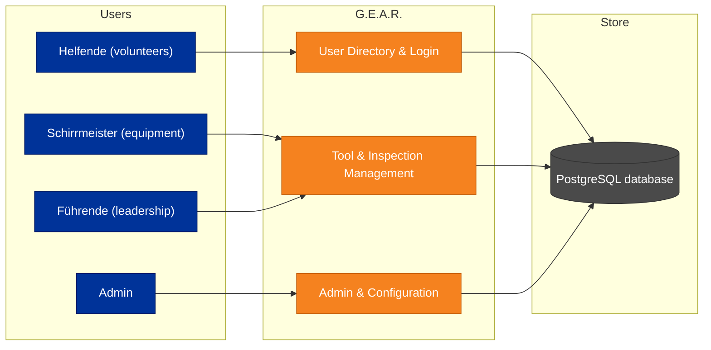
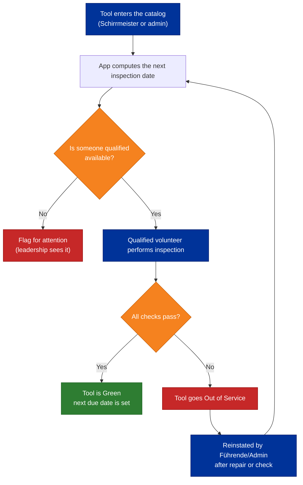
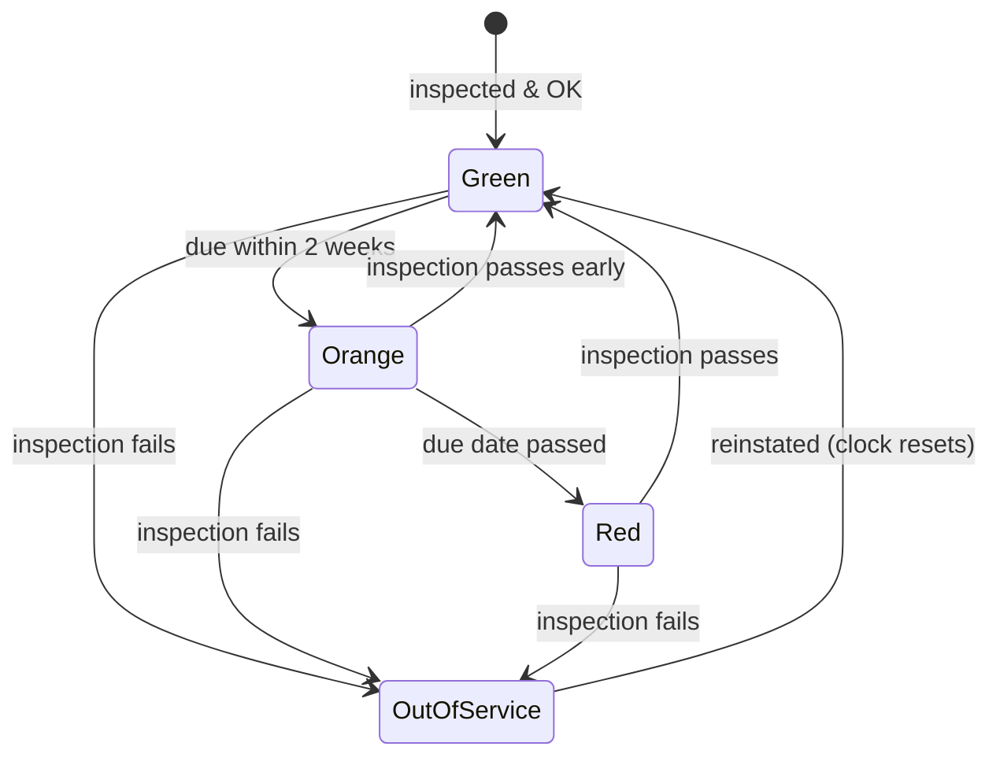

# Management Overview

**The G.E.A.R. keeps the Ortsverband's equipment inspection-ready — with the right tool, inspected by the right person, on time. No more paper lists, spreadsheets, or last-minute surprises.**

This page explains the app in plain language. It is written for decision-makers and new team members who are not (yet) familiar with the project. If you want the full detail, the [PRD](/docs/planning/prd) and [Architecture Spine](/docs/planning/architecture-spine) documents go much deeper.

---

## In one sentence

The app replaces the current manual, paper-driven way of tracking tool inspections with a shared digital system: every piece of equipment gets a clear status (green / orange / red / out of service), every inspection is performed by a **qualified** volunteer, and everything is recorded and reproducible.

## The problem it solves

The Ortsverband Singen manages many specialized tools and machines — chainsaws, generators, rescue equipment, and more. Today, staying on top of

- **who** may operate which tool (qualifications),
- **when** each tool must be inspected next,
- **what** happened at the last inspection, and
- **which** tools are currently safe to use

is manual work: paper logs, note-taking, and tribal knowledge. That creates risk:

- tools that miss their legally and operationally required inspection window,
- equipment used by people without the required qualification,
- no reliable record for questions, audits, or planning.

The app turns this into a simple, trustworthy process with a dashboard anyone can read at a glance.

## Who is it for?

| Role | Typical person | What they get |
|---|---|---|
| **Helfende** (volunteers) | Everyone who works with the equipment | Inspect tools, see what's due, record results |
| **Schirrmeister** | The equipment caretaker | Maintain the tool catalog, check inspection readiness |
| **Führende** (leadership) | Unit leaders | Overview, history, reports and export |
| **Admin** | One trusted administrator | Manage users, groups, roles, and DSGVO operations |

## The big picture

## How the inspection cycle works

The heart of the app is a simple, repeating cycle.

## The status traffic-light

Every tool always has exactly one status — **derived, never guessed**. That means the whole organization always looks at the same truth.

- 🟢 **Green** – inspected on time, safe to use
- 🟠 **Orange** – inspection is due within the next two weeks
- 🔴 **Red** – inspection is overdue (now or past due)
- ⬛ **Out of Service** – failed inspection, awaiting reinstatement

The **next inspection date is computed by one shared rule**: the last successful inspection plus the **schedule**. Schedules are named and reusable — "1 year", "1 quarter", "1 month", "2 weeks", "3 days" and more — each tool type picks a default schedule, and a single tool can pick its own instead. Admins manage the schedule catalog in the admin panel. When a tool is reinstated, the clock restarts from the reinstatement date — so no tool can "drift" into ambiguity.

## What goes into an inspection?

An inspection is either a simple **pass/fail** check or a **checklist** of individual items (the tool type decides). Importantly, the app also checks that the person performing the inspection **holds the required qualification** for that tool type — e.g. a chainsaw can only be inspected by someone with the chainsaw certificate. This is enforced by the system, not by memory.

## Why you can trust the data

- **One source of truth.** Status and due dates are always derived from the recorded inspections — there is no separate "status" that can go stale.
- **Full history.** Every inspection is recorded, so questions and audits are answered in seconds.
- **Qualifications are real.** They must be present in the system before an inspection is allowed.
- **Access is controlled.** What you can see or do depends on your role; the admin module is isolated and protected.
- **Passwords are yours to manage.** Every user can change their own password, and a forgotten password is recoverable with a secure email link (account recovery only — no automated notification emails). The email server that delivers these recovery links, the backup destinations where the data is stored, and the **schedule catalog** that drives inspection intervals are all configured in the admin panel, so each can be changed at any time without a redeploy.
- **Admins are protected by dual control.** The system starts with two admin accounts; neither can reset the other's credentials alone, so no single compromised account can take over the system.
- **DSGVO-compliant by design.** Personal data of volunteers is protected, with dedicated operations for access reports and deletion.

## What is in scope for version 1 — and what is not

| In scope (V1) | Not in scope (V1) |
|---|---|
| User directory, login, permissions, approval | Tool reservations / booking |
| Self-service password mgmt: change own password, forgot-password reset, dual-control admin recovery, admin-configurable email delivery, backup destinations & schedule catalog | Repair tracking and logs |
| Tool & tool-type catalog | Repair tracking and logs |
| Qualification-gated inspections (pass/fail + checklist) | Automated notifications |
| Status dashboard with traffic-light | Integration with external third-party systems |
| Inspection history & PDF reports | |

Out-of-scope items are candidates for later versions — the architecture is deliberately built so they can be added without reworking what exists.

## Tech, briefly

For those who care: the app is a **modular monolith** — a single deployable system split into three self-contained modules (User Directory, Tool Maintenance, Admin). The backend is **Go**, the frontend is **React + TypeScript**, and data lives in **PostgreSQL**. During the project, the architecture and planning documents describe all of this in detail.

---

## Where to go next

- The [full requirements](/docs/planning/prd) — the PRD
- The [architecture](/docs/planning/architecture-spine) — how it is built
- The [product brief](/docs/planning/product-brief) — the short concept
