# User Stories — G.E.A.R. in Action

Real screenshots from the running app, each showing one everyday story. The
colored dots are **live** — green, orange and red pulse to show the traffic
light at work.

## 🟢 Story 1 — A volunteer inspects a tool

**Lisa (Helfende)** opens the dashboard, sees that the **chainsaw** is due for
its inspection, and performs it — the system checks her qualification first.

 **Green** — ready to use
 **Orange** — due soon
 **Red** — overdue
 **Out of service**

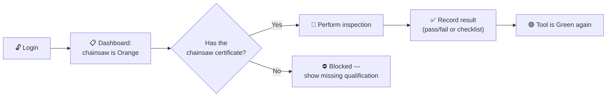

<figure className="gear-shot gear-story-shot gear-shot-frame-desktop">
  
  <figcaption>The dashboard — every tool with its live status. 🟢 🟠 🔴 ⬛</figcaption>
</figure>

---

## 🟠 Story 2 — A caretaker keeps the catalogue ready

**Jonas (Schirrmeister)** keeps the equipment catalogue up to date: tool types
with their inspection checklists, individual tools, and their schedules.

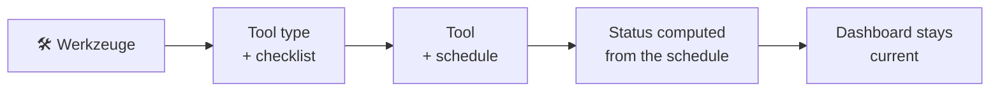

<figure className="gear-shot gear-story-shot gear-shot-frame-desktop">
  
  <figcaption>The admin tool catalogue (Werkzeuge).</figcaption>
</figure>

---

## 🔴 Story 3 — A leader spots an overdue tool

**Marie (Führende)** sees that an **aggregate** is overdue (Red). She opens the
tool's history, sees the last inspection and the reason, and can export the
report as a PDF for the leadership meeting.

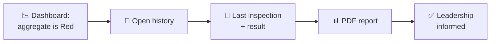

<figure className="gear-shot gear-story-shot gear-shot-frame-desktop">
  
  <figcaption>The per-tool history — every inspection and reinstatement.</figcaption>
</figure>

---

## ⬛ Story 4 — An out-of-service tool is reinstated

A tool failed its inspection and is now **Out of Service** (⬛). Only a
Führende or Admin can reinstate it — with a mandatory reason. The clock
restarts from the reinstatement.

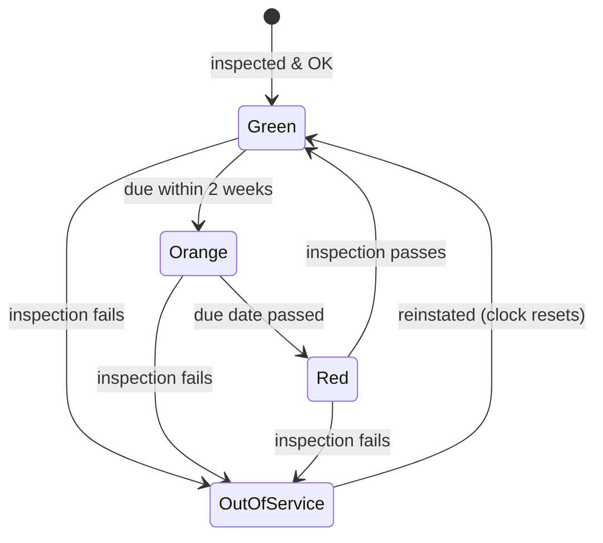

---

## 🛠️ Story 5 — An administrator manages users, roles and settings

**Anna (Admin)** approves new volunteers, assigns qualifications and roles, and
keeps the system settings, backup destinations and DSGVO operations configured.

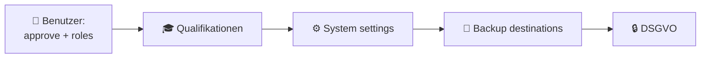

  <figure className="gear-shot gear-story-shot gear-shot-frame-desktop" style={{maxWidth:'560px', flex:'1 1 45%'}}>
    
    <figcaption>Admin — user directory with roles.</figcaption>
  </figure>
  <figure className="gear-shot gear-story-shot gear-shot-frame-desktop" style={{maxWidth:'560px', flex:'1 1 45%'}}>
    
    <figcaption>Admin — roles and permissions.</figcaption>
  </figure>

  <figure className="gear-shot gear-story-shot gear-shot-frame-desktop" style={{maxWidth:'560px', flex:'1 1 45%'}}>
    
    <figcaption>Admin — qualifications.</figcaption>
  </figure>
  <figure className="gear-shot gear-story-shot gear-shot-frame-desktop" style={{maxWidth:'560px', flex:'1 1 45%'}}>
    
    <figcaption>Admin — configurable system settings.</figcaption>
  </figure>

---

## 🆕 Story 6 — A new volunteer registers and waits for approval

**Tim (Helfende)** wants to help with the equipment. He registers himself — and
his account stays **pending** until an administrator approves it. Only then can
he log in.

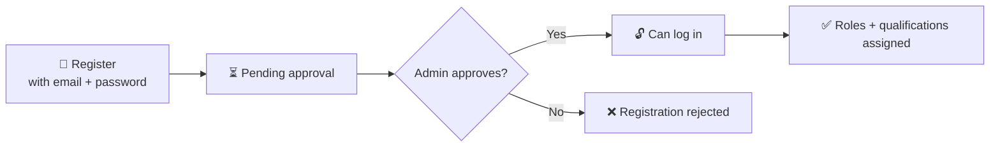

<figure className="gear-shot gear-story-shot gear-shot-frame-desktop">
  
  <figcaption>After approval, Tim logs in with his email and password.</figcaption>
</figure>

---

## 🔐 Story 7 — Logging in with two-factor authentication

**Sara (Schirrmeister)** enabled **OTP** on her account. Every login asks for the
current code from her authenticator app after the password — a stolen password
alone is not enough.

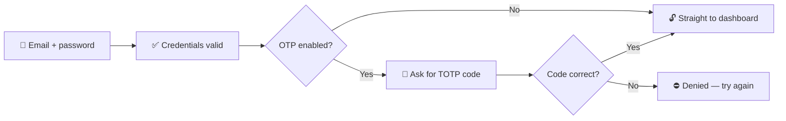

<figure className="gear-shot gear-story-shot gear-shot-frame-desktop">
  
  <figcaption>Login: password first, then the current OTP code.</figcaption>
</figure>

---

## 🚫 Story 8 — Locked out? Recover with a reset link

**Ben (Helfende)** mistyped his password a few times and is now **temporarily
locked out**. Instead of waiting, he uses *Forgot password* — the app sends a
secure, single-use reset link to his email.

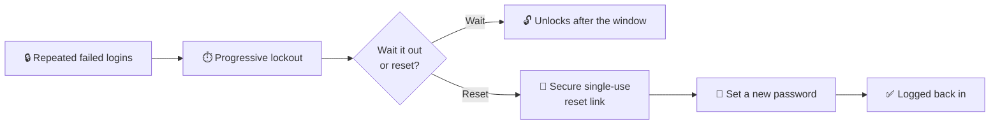

<figure className="gear-shot gear-story-shot gear-shot-frame-desktop">
  
  <figcaption>Forgot password — the recovery entry on the login screen.</figcaption>
</figure>

---

## 🔑 Story 9 — Admin unlocks an account with a one-time password

**Anna (Admin)** needs to force a password change for a user. She issues a
**one-time password** from the admin panel; the user signs in with it and must
immediately set a new password.

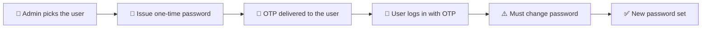

<figure className="gear-shot gear-story-shot gear-shot-frame-desktop">
  
  <figcaption>Admin — the user directory where a one-time password is issued.</figcaption>
</figure>

---

## 💾 Story 10 — Backups run automatically and can be restored

**Anna (Admin)** configures backup destinations (local disk + an S3 bucket).
The job runs daily on its own, ships a dated dump to every reachable
destination, and a failed destination never aborts the others. The restore
procedure is tested end-to-end.

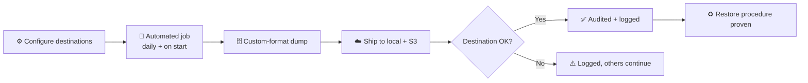

<figure className="gear-shot gear-story-shot gear-shot-frame-desktop">
  
  <figcaption>Admin — backup destinations with the connection test.</figcaption>
</figure>

---

## 📋 Story 11 — Onboarding the fleet with a CSV import

**Jonas (Schirrmeister)** inherits a long equipment list in a spreadsheet.
Instead of typing each tool, he uploads a **CSV** — the app creates the tools,
auto-assigns inventory numbers, and reports every row that cannot be imported
(e.g. a duplicate inventory number).

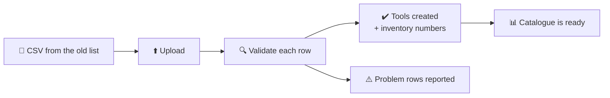

<figure className="gear-shot gear-story-shot gear-shot-frame-desktop">
  
  <figcaption>The catalogue after onboarding — tools with inventory numbers.</figcaption>
</figure>

---

## 🕊️ Story 12 — DSGVO: access report and clean deletion

**Anna (Admin)** handles a volunteer's data-protection request: she produces an
**access report** of every personal reference, or **deletes** the account —
rewriting the person's references to "Deleted User" while keeping the equipment
history intact.

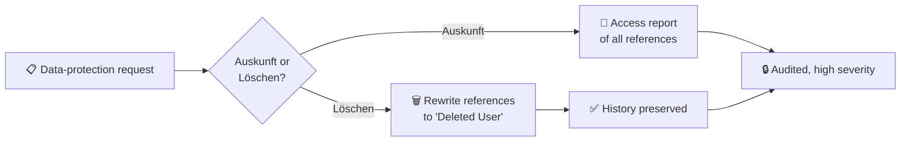

---

## 🤝 Story 13 — Dual-admin recovery

An admin loses access to their account. Because G.E.A.R. starts with **two
admin accounts**, recovery needs the **other admin's approval** — no single
account can reset the other's credentials alone.

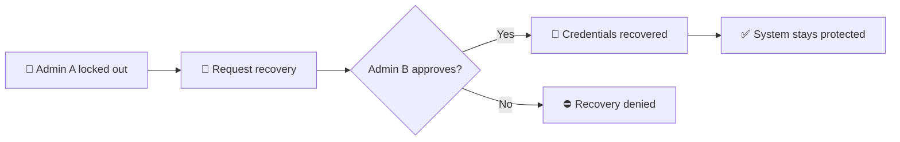

---

## The inspection cycle at a glance

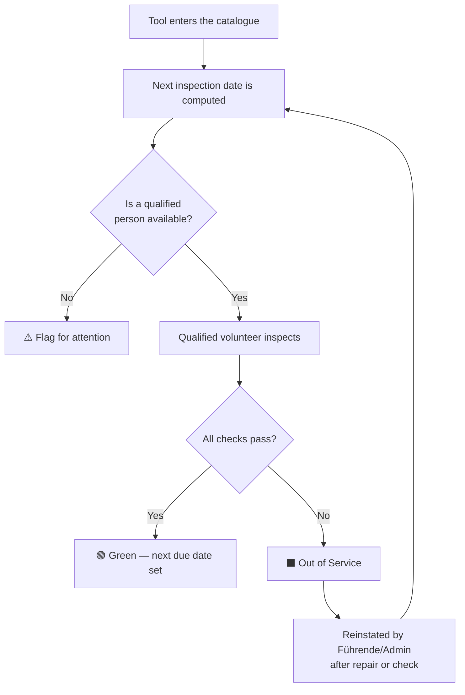

---

## Where the screenshots come from

The screenshots on this page are captured from the **running application** by a
scripted Playwright session
(`docs/scripts/capture-screenshots.js`). They show the real UI, not a design
mock-up. The full screenshot inventory (desktop + mobile, present or missing)
is tracked on the [screenshots page](/docs/screenshots).