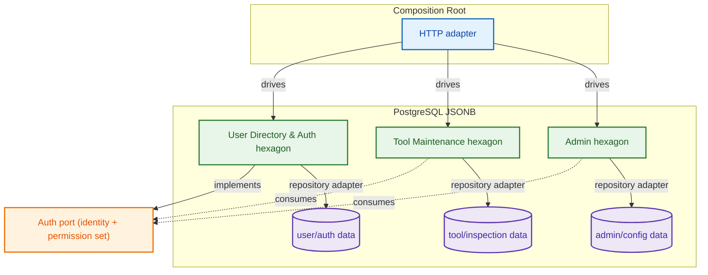
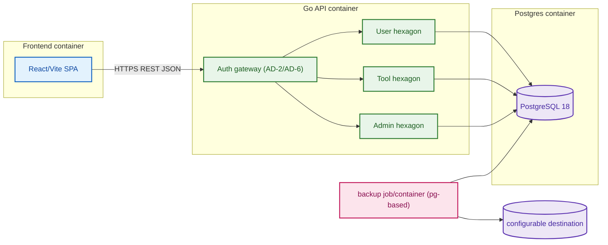
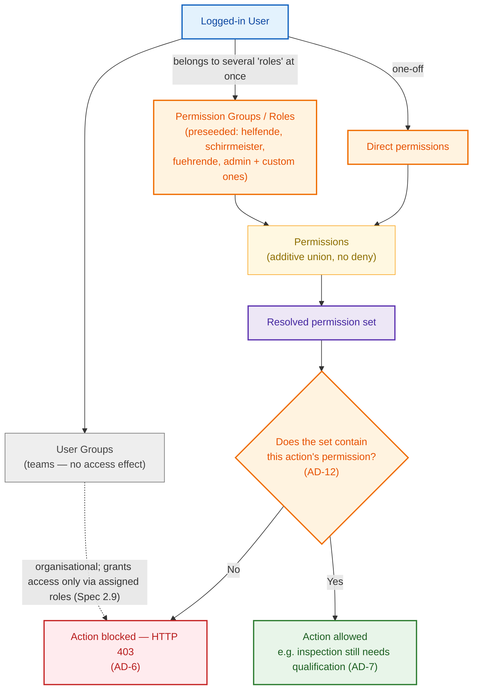
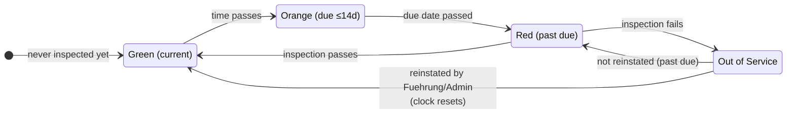
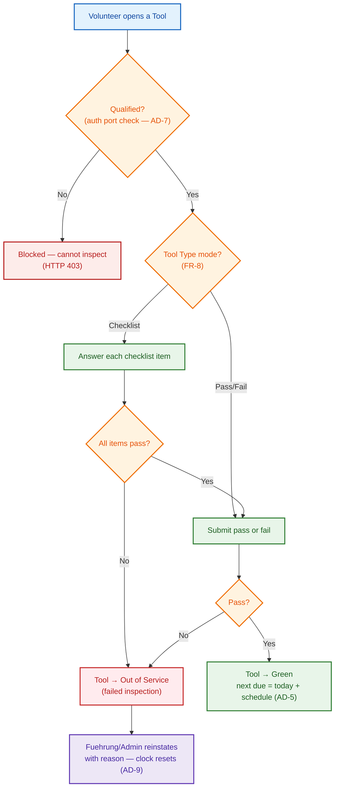
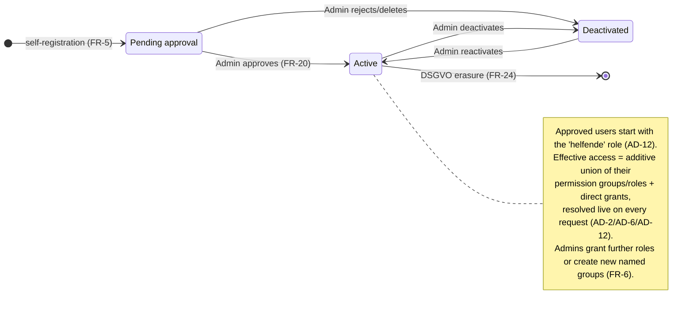

# Architecture Spine — G.E.A.R. V1

## Design Paradigm

**Modular monolith, hexagonally partitioned per module.** Each feature module (User Directory & Auth, Tool Maintenance, Admin) is a self-contained hexagon: domain/core in the middle owning the business rules, with inbound driving ports (application services/handlers) and outbound driven ports (repository interfaces) on the rim. Adapters (HTTP, DB) sit outside the hexagon and are wired together only at the composition root (`cmd/server`). Modules communicate exclusively through exported port interfaces — never through each other's adapters or storage, and never by reaching into another module's internals. This is what keeps a future module (vehicle logs, event scheduling) addable without modifying existing business logic (NFR-M1).

For V1 this is one deployable application (the monolith); the container/image split is free (see Stack + Structural Seed).

## Invariants & Rules



### AD-1 — Modular Monolith, Hexagonal per Module

- **Binds:** all — Epic 1, Epic 2, Epic 3, NFR-M1
- **Prevents:** two modules built independently selecting incompatible shapes; modules reaching into each other's storage or business logic; unpluggable modules
- **Rule:** Each feature module is an isolated Go package exposing only port interfaces across its boundary. All inbound HTTP and outbound DB/event adapters live outside the hexagon and are wired in the composition root only. No module imports another module's adapter, handler, or repository implementation; no in-memory shared state across module domains.

### AD-2 — User Directory & Auth Owns Identity and Permissions

- **Binds:** Epic 1 (FR-1..FR-6, FR-20, FR-21, FR-22, FR-25, FR-26, FR-27), Epic 2 (FR-11), Epic 3 (FR-19, FR-20, FR-24, FR-28), NFR-S2, NFR-S3
- **Prevents:** auth/permission logic being duplicated or owned by Tool Maintenance or Admin; divergent permission checks across modules; admin isolation leaking
- **Rule:** The User Directory & Auth module is the single owner of users, groups, permissions, sessions, MFA/TOTP, credentials and password-recovery tokens, account state (pending_approval/active/deactivated), and qualifications. It exposes a single port — `Service` — from which consumers resolve the current caller's identity, the caller's **granted Qualifications** (for AD-7), and the caller's *resolved permission set* (the additive union of all permission-group and direct grants, AD-12). Tool Maintenance and Admin consume only this port; they never store auth data, never author their own SQL over user/qualification tables, and never implement their own permission checks. FR-19 (admin route isolation, HTTP 403, existence hidden) is enforced server-side in the composition-root gateway against this port. **Permission and qualification revocation takes effect immediately on the very next check** — the auth port resolves against the live user state per request, never against a session-cached permission snapshot (FR-21/FR-22). New approved users are seeded with the `helfende` base role (AD-12, FR-5/FR-20). Password self-service, forgot-password recovery, and dual-control admin recovery all live in this module (FR-25/26/27, AD-13). For the FR-26 recovery email, the User module **consumes** SMTP settings from the Admin module's `smtp_settings` port (AD-14) — it does not own them.

### AD-3 — First-Class Columns + JSONB Extension Surface

- **Binds:** Epic 1 (FR-7), Epic 2 (FR-10), NFR-R2
- **Prevents:** DB migrations required for every new attribute; type-unsafe dumping of core data into JSON
- **Rule:** Users, Tools, and Tool Types expose first-class typed columns for all known/core attributes, plus exactly one `attributes JSONB` column per entity holding the extensible custom-attribute surface (FR-7/FR-10). New attributes that are not yet first-class land in JSONB with no schema migration. Migration path: when an attribute becomes core/queryable, promote it to a real column via golang-migrate and backfill, retaining the JSONB column for continued flexibility.

### AD-4 — Tool Status Is Derived, Never Stored

- **Binds:** Epic 2 (FR-14, FR-15, FR-16, FR-17, FR-18), Dashboard, status report
- **Prevents:** UI/API/dashboard drift from a separately-stored/short-lived status value; two independent consumers disagreeing on a tool's color
- **Rule:** A tool's status (Red/Orange/Green/Out-of-Service) is always computed on read from inspection records and due-date math — never stored as a column. Out-of-Service is itself derived: a tool is Out-of-Service (displayed Red) iff its latest inspection — or any checklist item of its latest checklist inspection — failed *and* it has not since been reinstated. **Reinstatement is the sole exit from Out-of-Service**: a later passing inspection is not enough; the Fuehrung/Admin reinstatement (AD-9) must record an event that clears it. A tool with no successful inspection yet and no next_due (never inspected) is displayed Red (not due / not ready). Computed with equal force against every read path (Dashboard, report export, tool detail).

### AD-5 — One Shared Inspection Clock (Due Date Per Tool)

- **Binds:** Epic 2 (FR-8, FR-9, FR-15, FR-16, FR-17, FR-18), AD-16
- **Prevents:** Dashboard and inspection module computing different next-due dates for the same tool; inconsistent treatment of schedule overrides
- **Rule:** `next_due` is computed per tool as `last_successful_inspection_date + <resolved schedule interval>`, where the **resolved schedule** is the Tool's individually chosen `schedules` row if set, else the Tool Type's default `schedules` row (FR-9, AD-16). The interval comes from the schedule's `interval_unit`/`interval_magnitude` (the weekday/time parts are unused in V1, AD-16). On Out-of-Service reinstatement the clock resets: `next_due = reinstatement_date + <resolved schedule interval>` (FR-15). Color thresholds (FR-16): Red = past due (or Out-of-Service); Orange = due within the next 14 calendar days; Green = due more than 14 days out. This exact rule is a single shared function all consumers call; a future weekday/time composite advances `next_due` to the schedule's next occurrence behind this same function (AD-16).

### AD-6 — Server-Side Authorization Is the Only Source of Truth

- **Binds:** Epic 3 (FR-19), NFR-S3, NFR-O1
- **Prevents:** front-end-only hiding of admin routes; direct-URL bypass of admin endpoints
- **Rule:** Every request-bearing capability (API route, admin operation, frontend action) is bound to exactly one permission code, and the server re-validates that the caller's resolved permission set (AD-12) contains it before the action runs — **a permission must match the action to carry it out**. If not present, the server returns HTTP 403 (FR-19) and the admin module's existence is not surfaced to non-Admins anywhere in the SPA. Frontend visibility is supplementary only and never substitutes for the server-side gate.

### AD-7 — Qualification Gating

- **Binds:** Epic 2 (FR-11, FR-12, FR-13, FR-14), Epic 3 (FR-22)
- **Prevents:** an unqualified user inspecting a tool despite UI affordances; divergence between "can initiate" and qualification records
- **Rule:** Qualification is data owned by the User Directory & Auth module (AD-2). A single, shared qualification vocabulary identifiers the required Qualification of a Tool Type and the granted Qualifications on a user; the Tool Maintenance module obtains both from the auth port (never by joining `users.qualifications` itself) and permits initiate/submit only when the caller holds the required one (FR-11). Tool Types declare their required Qualification via a `TOOL_TYPES→QUALIFICATIONS` cross-module reference owned by the Tool module but pointing at User-module qualification IDs (see AD-11). Assigning/revoking a Qualification in Admin takes effect immediately on the very next check (FR-22, AD-2).

### AD-8 — Cross-Module User-Lifecycle & DSGVO Data Flows

- **Binds:** Epic 1 (FR-5), Epic 3 (FR-24), NFR-O2, NFR-S3
- **Prevents:** the User or Admin module mutating another module's tables directly to satisfy user deletion; the DSGVO erasure/anonymization being split across two owners with clashing shapes; a deletion wedging mid-transaction
- **Rule:** User lifecycle events that reach other modules' data (account deletion → anonymized inspection history, FR-24; data-access report assembly) are executed by a single **composition-root orchestration** that calls each owning module through its exported port — never by one module writing another's SQL. When a user is deleted, the Tool Maintenance module's inspection history keeps its rows but the inspector reference is rewritten to the literal `"Deleted User"` (FR-24) via the Tool module's own user-lifecycle port; personal fields are purged from the User module and remain so. The whole DSGVO deletion runs as one transaction and produces an immutable audit entry (NFR-O2). Both Admin (operation trigger) and User module (lifecycle authority) cooperate through these ports; neither authors the other's tables.

### AD-9 — Out-of-Service Reinstatement (Fuehrung/Admin, Clock Reset)

- **Binds:** Epic 2 (FR-14, FR-15), Epic 3, NFR-O1
- **Prevents:** the Out-of-Service state being mutable by the wrong role; a reinstatement that fails to reset the inspection clock; diverging reinstate rules between Dashboard and tool detail
- **Rule:** Only **Fuehrung** and **Admin** (via the resolved permission set, AD-2/AD-6) can clear a Tool's Out-of-Service status (FR-15). Reinstatement requires a mandatory non-empty reason/notes field and records an event (actor, timestamp, reason). It is the sole exit from Out-of-Service (AD-4), and it **resets the inspection clock**: `next_due = reinstatement_date + <resolved schedule interval>` (AD-5). Helfer*in cannot reinstate. Every read path derives the post-reinstatement color from the reset `next_due` immediately.

### AD-10 — Tool/Tool-Type Configuration Write Path (Single Owner)

- **Binds:** Epic 2 (FR-8, FR-9), Epic 3 (FR-23), AD-5
- **Prevents:** Admin and Tool Maintenance both authoring the same tool/tool_type rows; a CSV admin import writing an `attributes`/`schedule` key that the shared due-date function never reads (adversarial two-sources-of-truth)
- **Rule:** Tools, Tool Types, and checklist items remain owned by the **Tool Maintenance** module (their persistence lives with AD-1's Tool hexagon). Admin configures them — including FR-23 checklist definition and FR-9 CSV bulk import — exclusively through the Tool module's exported **configuration port**, never by Admin-owned copies or ad-hoc SQL over the same tables. A Tool's custom schedule is a first-class FK to the Admin-owned `schedules` catalog (`tool.schedule_id`, never a JSONB `attributes` key, never an Admin-authored copy); schedule data is resolved only via AD-5/AD-16's shared function.

### AD-11 — Cross-Module Schema & Reference Ownership

- **Binds:** all — Epic 1, Epic 2, Epic 3, NFR-R2
- **Prevents:** two modules declaring the same table or name-colliding with a shared identifier; ambiguous cross-module foreign keys; two modules writing the same JSONB key with different shapes
- **Rule:** One golang-migrate migration set is the single schema authority (NFR-R2). Each table has exactly one owning module (users/auth → User; tools/tool_types/checklist/inspections → Tool; `smtp_settings`, `backup_destinations`, `schedules` → **Admin**; the whole set evolves only via migrations). Cross-module references (e.g. an inspection's `inspector_id` → user, a Tool Type's required Qualification → user-module qualification, a Tool/Tool-Type's `schedule_id`/`default_schedule_id` → admin-module schedule) are declared as foreign keys to the owning module's identifiers, with the referencing module reading those identifiers only through the owning module's port. JSONB `attributes` keys are unique per semantic meaning across the whole app (no two modules assign a different shape to the same key). The Admin module owns exactly **three** configuration tables (`smtp_settings`, `backup_destinations`, `schedules`, AD-14/AD-15/AD-16) as its operational-settings surface; it does not duplicate other modules' tables.

### AD-12 — Action-Matched, Additive Permission Model

- **Binds:** Epic 1 (FR-6, FR-21, FR-22), Epic 3 (FR-19, FR-21, FR-23), NFR-S3, AD-2, AD-6
- **Prevents:** roles granted without a matching capability; permission checks diverging from the shipped vocabulary; negative/deny permissions; users locked out by group nesting; a user accumulating rights that no longer bind to any real action
- **Rule:** The permission model is **flat and additive**:
  - **Every action in the app is tied to exactly one permission code** (the base series below). A user may carry out an action if and only if their *resolved permission set* contains that action's permission — nothing else grants it (NFR-S3). There are **no deny/negative permissions**; a permission present is granted, absent is denied.
  - **A user's resolved permission set is the additive union (set-union, no precedence) of all permissions from all their permission-group memberships and their direct grants.** Users may hold more than one group/role at once (FR-6). Removing a group/direct grant subtracts exactly its permissions, immediately.
  - **Roles are just named permission groups.** Four **base roles** ship pre-seeded: `helfende`, `fuehrende`, `admin`, `schirrmeister` (see the role matrix). **Admins may create additional permission groups, give them a name, choose their permissions, and assign them to users** — and may also edit the permission sets of the base roles themselves (all are the same kind of entity). These groups are **flat: no groups inside groups in V1** — a permission group contains only permissions, never other groups.
  - **V1 flatness:** because groups cannot nest, resolution is a single level of union over a user's groups plus direct grants; there is no transitive inclusion to compute.
  - **User groups are organisational** (team membership) and grant **no** permission BY THEMSELVES — but a team can hold permission groups (roles) via `user_group_permission_groups`, so membership grants those roles' permissions (Spec 2.9 three-way union: individual roles + team roles + direct grants). A team with no assigned roles still grants nothing (isolation preserved, AD-2/AD-12).
  - On approval (FR-5/FR-20) a new user is seeded with the **`helfende`** base role; an admin can add/remove roles thereafter.

### AD-13 — Self-Service Password Management + Dual-Admin Credential Recovery

- **Binds:** Epic 1 (FR-25, FR-26, FR-27), NFR-S2, NFR-S4, NFR-O2, AD-2, AD-12
- **Prevents:** passwords unrecoverable for day-to-day users; single-admin accounts that a single compromise could take over; admin lockout with no safe recovery path; reset tokens that are replayable or long-lived
- **Rule:** The User module owns all credential and recovery flows (FR-25/26/27, AD-2) and exposes them purely through its `Service` port:
  - **Change own password (FR-25).** Any authenticated user changes their own password by confirming the current password and satisfying the FR-2 policy (≥ 10 chars). Password hashes use Argon2id; plaintext is never stored or logged. A successful change revokes the user's other server-side sessions and is audited (NFR-O1). No elevated permission is required — access is intrinsic to one's own account (no `*` permission needed; gated only by authentication, consistent with AD-12's "one permission per action", where ownership of self is the capability).
  - **Forgot-password reset (FR-26).** The login flow accepts an email; if it matches an `active` account, the module emits a **single transactional email** over SMTP (parameters read from admin-configured email-settings, AD-14) carrying a single-use, 30-minute, hashed-at-rest reset token (newer request invalidates older ones). Response is uniform for known/unknown email (no enumeration, NFR-S1-friendly). Reset enforces FR-2 and revokes sessions; audited. This email is the **only** email in V1 and does not reopen the automated-notification non-goal (PRD §5).
  - **Dual-admin recovery (FR-27).** Exactly **two `admin` accounts are seeded** at deployment; credentials are generated and distributed out-of-band (NFR-S4), never in VCS. An admin in a locked-out/forgotten state **cannot** self-reset via the FR-26 flow alone; recovery requires the **other admin's** authorization, is gated by an admin-only permission (see base series `admin.recovery.approve`), and is recorded as a high-severity immutable audit event (NFR-O2). Recovery of the **last remaining** admin is deliberately **not** reachable by any self-service path; it is a documented, out-of-band manual bootstrap requiring both admins (or a designated recovery sponsor). Recovery always enforces FR-2.
- **Seeding note (extends AD-12/FR-5):** the two base admins are seeded with the `admin` role and the `admin.recovery.approve` permission; all four base roles plus the two admin accounts are part of the cold-start migration seed (NFR-R2).

### AD-14 — Admin-Configurable Email/SMTP Settings (Single Writer)

- **Binds:** Epic 3 (FR-28), Epic 1 (FR-26), NFR-S4, NFR-O2, NFR-R2, AD-2, AD-6, AD-11
- **Prevents:** SMTP parameters locked into env/deploy config requiring a redeploy to change; two modules writing conflicting delivery settings; the SMTP password stored or displayed in plaintext
- **Rule:** SMTP email-delivery settings are a **system-wide configuration surface, owned by the Admin module** (the module responsible for configuration, AD-1). They are edited only from the Admin panel (FR-28) by users holding the admin-only `admin.settings.email` permission (AD-6/AD-12). The settings row(s) persist in the Admin module's own **`smtp_settings`** table (one of Admin's three operational-settings tables, AD-11) and are **read at runtime by the User module's email adapter** through the Admin module's exported **settings port**, purely as a consumer (the User module authors no copy, AD-2/AD-11). Persistence is migration-backed (NFR-R2). The SMTP **password is stored encrypted at rest** (app-level key from env/secret-manager, NFR-S4) and is **write-only/masked** in the UI (never returned in plaintext). The surface includes host, port, connection security (none/STARTTLS/TLS), sender address & display name, username, password, and a **"send test email"** action that exercises the live configuration and returns success/failure. All writes and send attempts are audited (NFR-O1/NFR-O2). Runtime delivery failures during FR-26 are logged, never thrown away silently.

### AD-15 — Admin-Configurable Backup Destinations (NFR-R3)

- **Binds:** Epic 3 (FR-29), NFR-R3, NFR-S4, NFR-O2, NFR-R2, AD-1, AD-11
- **Prevents:** backup targets hard-coded into env/deploy config requiring a redeploy to change; two modules writing conflicting destination settings; backup credentials stored or displayed in plaintext
- **Rule:** Backup destinations are **system-wide operational settings owned by the Admin module**. They are edited only from the Admin panel (FR-29) by users holding the admin-only `admin.settings.backup` permission (AD-6/AD-12), and persist in the Admin-owned **`backup_destinations`** table (AD-11). One or more destinations are configurable (NFR-R3 makes ≥1 required; the table is **multi-row with no single-row guard**); each records a **mechanism type** (concretely **`s3`** S3-compatible object store, **`ftp`**/ **`sftp`**, or **`local`** filesystem — enforced by a CHECK constraint, migration 000018), endpoint/host, bucket/path, credentials, and an optional schedule/frequency. Credentials are stored **encrypted at rest** (app-level key from env/secret-manager, NFR-S4) and **write-only/masked** in the UI (a `credential_configured` boolean is the only thing a client ever sees). A **"Verbindung testen"** action verifies reachability/writability per the stdlib-partial depth decision: local does a real file round-trip, s3 a hand-rolled SigV4 PUT, ftp a reachability+auth handshake, sftp an SSH auth handshake. The backup job reads destinations through the Admin module's exported **settings port**; it never embeds its own copy. All writes and test/rotate actions are audited (NFR-O1/NFR-O2); failed backups are logged and alert via the status dashboard (no automated email/push in V1, PRD §5).

### AD-16 — Named Schedule Catalog (Admin-Owned, Cross-Module)

- **Binds:** Epic 2 (FR-8, FR-9, FR-30), Epic 3 (FR-30), AD-5, AD-11
- **Prevents:** hard-coded intervals scattered across tool/tool-type rows; schedule definitions duplicated or inconsistently edited across future modules; tightly-coupled timing fields that would block extending schedules with a day-of-week/time part later
- **Rule:** **Schedules** are a **named catalog owned by the Admin module** (a cross-cutting operational setting reusable by future modules — vehicle logs, event scheduling — not tool-specific business logic). Each schedule row has a **`name`** (e.g. "1 year", "1 quarter", "1 month", "2 weeks", "3 days") and, for V1, a **repeating interval** expressed as a unit + magnitude (e.g. `interval_unit`, `interval_magnitude`) that the shared inspection clock (AD-5) uses. Schedules are **prepared for future enhancement**: each row also carries a reserved **weekday set** (one or several days of week) and a **time-of-day** part, similar in spirit to cron — **nullable/unused in V1** but part of the schema so a later composite timing (e.g. "every Monday & Thursday at 08:00") needs no migration. Admins create/edit/archive schedules (FR-30) via the admin-only `schedules.manage` permission (AD-6/AD-12). Lenient validation in V1: a schedule must have a name and an interval; the weekday/time fields are optional and ignored until a later enhancement. **Tool Types and Tools reference a schedule by FK** (default schedule per tool type; optional per-tool choice), reading the schedule through the Admin module's **settings/schedule port** — never by duplicating the interval, and never by authoring `schedules` rows themselves (AD-11).

## Consistency Conventions

| Concern | Convention |
| --- | --- |
| IDs | UUID (v7) primary keys for all entities; opaque, never exposed via sequential integers |
| Timestamps | UTC, RFC 3339; all "now" from one clock source (server `time.Now`), never client clocks |
| Dates | Inspection dates stored as `date`; due-date math done in UTC day-boundaries |
| Error shape | Uniform JSON error envelope `{ "error": { "code", "message", "details?" } }`; matching HTTP status codes per PRD (401, 403, 429, etc.) |
| Permission checking | Occur solely through the auth port's resolved permission set (AD-2, AD-6); one shared permission-code vocabulary across all modules |
| Table ownership | Each table owned by exactly one module; cross-module references via FK + owning-module port (AD-11) |
| JSONB keys | Unique semantic meaning across the whole app; no two modules assign different shapes to one key (AD-3, AD-11) |
| Mutations | All cross-entity writes in a DB transaction; inspection submission and status effects atomic; DSGVO deletion cross-module + atomic (AD-8) |
| Logging | Structured JSON (NFR-O1); auth events, permission denials, inspections, Out-of-Service transitions, reinstatements, DSGVO ops logged |
| Flexible attrs | Accessed via JSONB `attributes` column only through typed helpers; no ad-hoc raw SQL across modules |
| Modules | Standard library, chi, sqlc/pgx — never a different router/ORM per module |

## Stack

Seed — verified current at authoring (2026-08-30); code owns these once they exist.

| Name | Version |
| --- | --- |
| Go | 1.27 (current stable on 2026-08-30; note 1.24 is EOL) |
| go-chi/chi | v5.3.2 (requires Go ≥1.23) |
| sqlc (pgx codegen) | v1.31.1 |
| jackc/pgx | v5 |
| golang-migrate | v4.19.1 |
| PostgreSQL | 18 (current stable) |
| TypeScript | 6.x (7.x is native/current; adopt 6.x safely for tooling maturity) |
| React | 19 |
| Vite | 8.x (current stable) |
| Docker / docker-compose | latest stable — used for deployed targets (NFR-R1) |
| Podman / podman-compose | local development container runtime (drop-in alternative to Docker) |
| just | github.com/casey/just (1.x) — project command runner; single `justfile` for dev & deploy recipes |
| OpenTofu | v1.12.6 (`tofu`) — IaC for provisioning cloud resources, incl. GCP |
| Google Provider (OpenTofu) | google 5.x — provisions Cloud Run, Artifact Registry, Cloud SQL tiers |
| Google Cloud Run | managed serverless containers; `min_instance_count = 0` scales to zero when idle |

Security note: GO-2026-4316 (open redirect via `RedirectSlashes`) affects chi **v5.2.2–5.2.3**, fixed in v5.2.4; pinning chi v5.3.2+ avoids it. Run dependency/security scans in CI (NFR-S5).

**Local development** runs the multi-service stack with **Podman / podman-compose** (compatible with the same Compose definition used by Docker in deployment). The Compose file is the single source for both runtimes.

## Structural Seed

The build owns detail; this is the cold-start scaffold and the operational envelope.

```text
cmd/server/            # composition root: wire hexagons + adapters; mount HTTP, gateways, middleware
internal/
  user/               # User Directory & Auth hexagon (core, ports, adapters)
  tools/              # Tool Maintenance hexagon
  admin/              # Admin hexagon (configuration + DSGVO operations)
                      # — materialized in Story 3.1: core/ports/adapters with its
                      #   own sqlc store (internal/admin/adapters/postgres,
                      #   migration 000017 `smtp_settings`) and HTTP surface
                      #   (/api/v1/admin/settings, gated by admin.settings.email);
                      #   the User reset sender consumes settings read-only via
                      #   the Admin settings port (AD-14)
  platform/           # cross-cutting: logger, config, migrate, middleware (NOT business)
web/                  # React + Vite + TS SPA (frontend UI; no business logic)
migrations/           # golang-migrate versioned SQL (NFR-R2)
deploy/               # compose definition (docker-compose / podman-compose) + backup config
infra/                # OpenTofu modules for cloud resources (GCP: Cloud Run, Artifact Registry, Cloud SQL)
justfile              # dev & deploy command recipes (casey/just); single entry point for the project
docs/                 # Docusaurus documentation site (NFR-M4)
```



## Database Artifacts

The one golang-migrate schema (NFR-R2, AD-11) holds every table the app persists. **User Groups** (who people are / how volunteers are organised) and **Permission Groups** (what people are allowed to do) are **two separate tables** — a volunteer's team membership is independent of the access they hold (FR-6, FR-21). Roles and permission groups are the **same kind of entity**: the four base roles (`helfende`, `fuehrende`, `admin`, `schirrmeister`) are just pre-seeded permission groups; admins can create more named ones (AD-12). In addition to the base roles, the deployment seed creates **two `admin` accounts** (dual-admin bootstrap, FR-27 / AD-13) whose credentials are generated and distributed out-of-band. Permission groups are **flat — no groups inside groups in V1**. Each table below belongs to exactly one module and may only be reached through that module's port (AD-1, AD-11).

| # | Table | Stores | Owned by | Notes / Non-technical meaning |
| --- | --- | --- | --- | --- |
| 1 | `users` | One row per person (name, email, account state, MFA flag) | User | The people. `state` = `pending_approval` / `active` / `deactivated` (FR-5). `attributes JSONB` carries flexible metadata (FR-7). |
| 2 | `user_groups` | Organisational groups (e.g. "Gruppe Ost", "Fachgruppe Wassergefahren") | User | The **teams** volunteers are part of — organisational by itself, but a team can hold roles via `user_group_permission_groups` (Spec 2.9) so membership inherits them. A role-less team grants nothing (AD-12). |
| 3 | `user_group_members` | The link: which user is in which user group (many-to-many) | User | "Who belongs to which team." |
| 4 | `permission_groups` | Named bundles of permissions — the **roles**. Pre-seeded: `helfende`, `fuehrende`, `admin`, `schirrmeister`; admins may add named groups (AD-12) | User | The **roles** that grant access. Users can belong to several at once; rights are additive (FR-6). Flat (no nesting). |
| 5 | `permissions` | The granular permission codes (the base series below — one per app action) | User | Individual capabilities; a user may perform an action iff its permission is in their resolved set (AD-12). |
| 6 | `permission_group_permissions` | Which permissions a permission group (role) contains (many-to-many) | User | "The `admin` role includes these capabilities." Editable to redefine roles (incl. base roles). |
| 7 | `user_permission_groups` | Which permission groups (roles) a user belongs to (many-to-many) | User | "This person is `admin` **and** `schirrmeister`." Effective rights = union of all these + direct grants (AD-12). |
| 8 | `user_permissions` | Direct one-off permissions granted to a single user (many-to-many, additive) | User | Ad-hoc individual grants that bypass any group (FR-6). No negative/deny entries (AD-12). |
| 9 | `qualifications` | The qualification vocabulary (e.g. "Chainsaw", "Generator") | User | The recognised safety certificates. A qualification itself has NO valid-until date (2026-09-08 rework) — only its expiry kind (unlimited/fixed); a per-user valid-until lives on `user_qualifications.expires_at` (Spec 2.9). |
| 10 | `user_qualifications` | Which certificates a person holds (many-to-many) | User | "This person holds the Chainsaw certificate." Carries the per-assignment valid-until (`expires_at`, Spec 2.9 — NULL for unlimited assignments, never expires). Feeds AD-7 gating. |
| 11 | `audit_log` | Immutable record of auth, permission, inspection, reinstate, qualification & DSGVO events | User | Compliance trail (NFR-O1, NFR-O2). |
| 12 | `tool_types` | Equipment categories (chainsaw, generator…) + default schedule, mode, required qualification | Tool | The equipment catalogue; defines a **default schedule** (FK → `schedules`) + pass/fail or checklist mode (FR-8). Label + `attributes JSONB`. |
| 13 | `tool_type_qualifications` | Which qualification is required to inspect each tool type (cross-module ref) | Tool | Gating link — a tool type's required certificate (FR-8, AD-7). |
| 14 | `checklist_items` | The checklist questions/tasks a tool type defines | Tool | Definition of checklist-based inspection (FR-8, FR-12, FR-23). `schedule_override`-style ordering is code-level. |
| 15 | `tools` | Individual physical items, each belonging to a tool type | Tool | The actual equipment on site. Optional **`schedule_id`** (per-tool schedule choice, FK → `schedules`; null = use tool type default) (FR-9) + `attributes JSONB` (FR-10). |
| 16 | `inspections` | Every inspection run (header): tool, inspector, date, result | Tool | The inspection log (FR-18). Never deleted; anonymised on user deletion (FR-24). |
| 17 | `inspection_items` | Per-checkline results for checklist inspections | Tool | Checklist details, if the tool type is checklist mode (FR-12). |
| 18 | `reinstatements` | Out-of-Service clearing events (actor, reason, date) | Tool | Who cleared a tool Out-of-Service and why (AD-9). Sole exit from OOS (AD-4). |
| 19 | `password_reset_tokens` | Single-use, expiring credential-recovery tokens (hashed value, user, expiry, agent/approver) | User | Powers FR-26 forgot-password reset and FR-27 dual-admin recovery. One active token per user; new request invalidates older ones (AD-13). |
| 20 | `smtp_settings` | Admin-configured SMTP email-delivery parameters (host, port, security, sender, username, encrypted password) | Admin | System-wide config, edited once from the Admin UI (FR-28, AD-14). Password encrypted at rest; write-only/masked. Consumed by the User module's email adapter via Admin's settings port. |
| 21 | `backup_destinations` | Admin-configured backup targets (type S3/FTP/etc., endpoint, bucket/path, credentials, schedule) | Admin | Where automated backups are delivered (NFR-R3, AD-15). Edited once from the Admin UI (FR-29). Credentials encrypted at rest; masked in UI. |
| 22 | `schedules` | The **named schedule catalog** (e.g. "1 year", "1 quarter", "1 month", "2 weeks", "3 days"): name + V1 interval (unit/magnitude) + reserved weekday-set & time-of-day fields for future composite timing | Admin | Cross-cutting config reusable by future modules (FR-30, AD-16). Tool Types (`default_schedule_id`) and Tools (`schedule_id`) reference rows by FK; admins create/edit via `schedules.manage`. Weekday/time fields nullable & unused in V1 (cron-like, AD-16). |

> **Attribution:** tables 1–11 and **19** belong to the **User** hexagon, 12–18 to the **Tool** hexagon, and **20–22** (operational settings: `smtp_settings`, `backup_destinations`, `schedules`) to the **Admin** hexagon. The Admin module owns these three small configuration tables (AD-14/AD-15/AD-16) and no others — it otherwise configures through the Tool module's config port and the User module's lifecycle/credential-recovery ports (AD-8, AD-10, AD-13).

### Base permission series (visible from day one)

Every **action** in the app maps to exactly one permission code (AD-12). This is the complete V1 base series — one row per action. Admins grant/revoke these; the codes never change shape, only which role has them. A user performs an action **iff** its code is in their resolved (additive-union) permission set.

| Permission code | The action it guards | Module |
| --- | --- | --- |
| `dashboard.view` | View the status dashboard (FR-16) | Tool |
| `inspection.submit` | Initiate & submit an inspection (FR-11/12/13; **also** needs the qualification of the tool type, AD-7) | Tool |
| `inspection.history.view` | View a tool's inspection history (FR-18) | Tool |
| `report.export` | Export the PDF status report (FR-17) | Tool |
| `tool.reinstate` | Clear a tool's Out-of-Service status (FR-15) | Tool |
| `tools.manage` | Create/edit tools, CSV bulk import (FR-9) | Tool |
| `tool_types.manage` | Create/edit tool types & checklist items (FR-8, FR-23) | Tool |
| `users.view` | View the user directory | User |
| `users.qualifications.manage` | Assign/revoke qualifications on users + edit per-user valid-until (Spec 2.9) | User |
| `users.approve` | Approve/reject pending registrations (FR-20) | User |
| `users.manage` | Create/edit/deactivate user accounts (FR-21) | User |
| `user_groups.manage` | Create/edit user groups & assign members (FR-21) | User |
| `roles.create` | Create a new named permission group (AD-12) | User |
| `roles.edit` | Change the permissions inside a permission group, incl. the 4 base roles (AD-12) | User |
| `roles.assign` | Assign permission groups/roles to users (FR-6) | User |
| `qualifications.manage` | Create qualifications, assign/revoke on users (FR-22) | User |
| `dsgvo.access_report` | Generate a user's data access report (FR-24) | User |
| `dsgvo.delete` | Execute account deletion / right-to-be-forgotten (FR-24) | User |
| `admin.recovery.approve` | Authorize credential recovery for a locked-out/forgotten admin (FR-27) | User |
| `admin.settings.email` | Configure SMTP/email-delivery settings in the Admin panel (FR-28) | Admin |
| `admin.settings.backup` | Configure backup destinations in the Admin panel (FR-29) | Admin |
| `schedules.manage` | Create/edit/archive named schedules in the catalog (FR-30) | Admin |

### Base role matrix

The **additive** permission set each of the four base roles ships with. A tick means the role's members carry that permission; holding several roles adds the ticks together (AD-12). **Bold** marks the permission(s) a role uniquely stands out with.

| Permission | `helfende` | `schirrmeister` | `fuehrende` | `admin` |
| --- | :---: | :---: | :---: | :---: |
| `dashboard.view` | ✔ | ✔ | ✔ | ✔ |
| `inspection.submit` | ✔ | ✔ | ✔ | ✔ |
| `tools.manage` | | ✔ | ✔ | ✔ |
| `tool_types.manage` | | ✔ | ✔ | ✔ |
| `inspection.history.view` | | ✔ | ✔ | ✔ |
| `report.export` | | | ✔ | ✔ |
| `tool.reinstate` | | | ✔ | ✔ |
| `users.view` | | ✔ | ✔ | ✔ |
| `users.qualifications.manage` | | ✔ | ✔ | ✔ |
| `users.approve` | | | | ✔ |
| `users.manage` | | | | ✔ |
| `user_groups.manage` | | | | ✔ |
| `roles.create` | | | | ✔ |
| `roles.edit` | | | | ✔ |
| `roles.assign` | | | | ✔ |
| `qualifications.manage` | | | | ✔ |
| `dsgvo.access_report` | | | | ✔ |
| `dsgvo.delete` | | | | ✔ |
| `admin.recovery.approve` | | | | ✔ |
| `admin.settings.email` | | | | ✔ |
| `admin.settings.backup` | | | | ✔ |
| `schedules.manage` | | | | ✔ |

> **Reading the matrix:** `helfende` = "volunteer who inspects". `schirrmeister` = **equipment caretaker** — everything a volunteer can do, **plus** managing tools and tool types (and their inspection history). `fuehrende` = **leadership** — inspection plus history, PDF export, reinstate, tool/tool-type administration (per user decision, Story 2.3), and (Spec 2.9) reading the user directory + assigning qualifications/valid-until alongside the Schirrmeister. `admin` = **everything**. All four are editable by an admin, and new custom groups can be added (AD-12). Inspection still always needs the tool type's required qualification (AD-7), independent of these roles.

**Entity relations** (derivations are AD-4/AD-5; attribute detail is owned by code):

```mermaid
erDiagram
    USERS ||--o{ USER_GROUP_MEMBERS : has
    USER_GROUPS ||--o{ USER_GROUP_MEMBERS : contains
    USERS ||--o{ USER_PERMISSION_GROUPS : assigned
    PERMISSION_GROUPS ||--o{ USER_PERMISSION_GROUPS : assigned
    PERMISSION_GROUPS ||--o{ PERMISSION_GROUP_PERMISSIONS : includes
    PERMISSIONS ||--o{ PERMISSION_GROUP_PERMISSIONS : included_in
    USERS ||--o{ USER_PERMISSIONS : granted
    PERMISSIONS ||--o{ USER_PERMISSIONS : granted_to
    USERS ||--o{ USER_QUALIFICATIONS : holds
    QUALIFICATIONS ||--o{ USER_QUALIFICATIONS : held_by
    USERS ||--o{ PASSWORD_RESET_TOKENS : issues
    TOOL_TYPES ||--o{ TOOL_TYPE_QUALIFICATIONS : requires
    QUALIFICATIONS ||--o{ TOOL_TYPE_QUALIFICATIONS : required_by
    TOOL_TYPES ||--o{ CHECKLIST_ITEMS : defines
    TOOL_TYPES ||--o{ TOOLS : classifies
    TOOL_TYPES }|--|| SCHEDULES : default_schedule
    TOOLS }o--|| SCHEDULES : chosen_schedule
    TOOLS ||--o{ INSPECTIONS : receives
    INSPECTIONS ||--o{ INSPECTION_ITEMS : has
    USERS ||--o{ INSPECTIONS : performs

    classDef u fill:#fff3e0,stroke:#ef6c00,color:#e65100,stroke-width:2px
    classDef ujunc fill:#fff8e1,stroke:#f9a825,color:#8d6e00,stroke-width:1px
    classDef t fill:#e8f5e9,stroke:#2e7d32,color:#1b5e20,stroke-width:2px
    classDef tjunc fill:#f1f8e9,stroke:#7cb342,color:#33691e,stroke-width:1px
    classDef cross fill:#f3e5f5,stroke:#8e24aa,color:#4a148c,stroke-width:2px
    classDef a fill:#ede7f6,stroke:#5e35b1,color:#4527a0,stroke-width:2px
    class USERS u
    class USER_GROUPS u
    class PERMISSION_GROUPS u
    class PERMISSIONS u
    class QUALIFICATIONS u
    class PASSWORD_RESET_TOKENS u
    class SMTP_SETTINGS a
    class BACKUP_DESTINATIONS a
    class SCHEDULES a
    class USER_GROUP_MEMBERS ujunc
    class USER_PERMISSION_GROUPS ujunc
    class PERMISSION_GROUP_PERMISSIONS ujunc
    class USER_PERMISSIONS ujunc
    class USER_QUALIFICATIONS ujunc
    class TOOL_TYPES t
    class TOOLS t
    class INSPECTIONS t
    class INSPECTION_ITEMS t
    class CHECKLIST_ITEMS t
    class TOOL_TYPE_QUALIFICATIONS cross
```



**Who can do what** — how a logged-in user's effective access is resolved (AD-2, AD-6, AD-12). Every request re-resolves this live against the tables above, so revoking a role/direct grant/qualification takes effect immediately. Permissions are **additive** (set union, no precedence) and a permission must **match the action** for it to run:



## The user-facing flows

These diagrams are the day-to-day behaviour a volunteer, a leader and an admin experience. They are what the invariants above guarantee, shown end-to-end.

**Tool status lifecycle** — how a piece of equipment moves between the colour states on the dashboard. Status is always **derived from stored facts** (inspections, due dates, reinstatements), never saved as a value, so the list can never disagree with the detail view (AD-4/AD-5):



**Inspection flow** — what happens when a volunteer carries out an inspection in the warehouse. Only a qualified person can proceed, and the outcome automatically updates the tool's status and next due date (AD-5, AD-7):



**User approval lifecycle** — how a new volunteer gets an account and access (FR-5, FR-20; AD-2):



## Capability → Architecture Map

| Capability / Area | Lives in | Governed by |
| --- | --- | --- |
| Epic 1 — User Directory & Auth (FR-1..FR-7, FR-25..FR-27) | `internal/user` hexagon (core + auth port) | AD-2, AD-3, AD-13 |
| Epic 2 — Tool Maintenance (FR-8..FR-18) | `internal/tools` hexagon | AD-4, AD-5, AD-7, AD-9, AD-10, AD-16 |
| Epic 3 — Admin & Config (FR-19..FR-24, FR-28, FR-29, FR-30) | `internal/admin` hexagon | AD-2, AD-6, AD-8, AD-10, AD-14, AD-15, AD-16 |
| Cross-module auth/permissions | `internal/user` auth port consumed by all | AD-2, AD-6, AD-11, AD-12 |
| Permission model (roles, additive access, action match) | `internal/user` core (vocabulary + resolution) | AD-12, AD-2, AD-6 |
| Password self-service & admin credential recovery (FR-25/26/27) | `internal/user` core (credentials + reset tokens) | AD-13, AD-2 |
| SMTP/email-settings configuration (FR-28) | `internal/admin` settings; consumed by User email adapter | AD-14, AD-2 |
| Backup destination configuration (FR-29) | `internal/admin` settings; consumed by backup job | AD-15 |
| Schedule catalog (FR-30) | `internal/admin` settings; schedule rows consumed by Tool module (tool-type default / per-tool choice) | AD-16, AD-5, AD-11 |
| Tool status & dashboard | `internal/tools` (derived) | AD-4, AD-5 |
| Tool/Tool-Type config write path | Admin triggers → Tool module config port | AD-10 |
| DSGVO ops (FR-24) / user lifecycle | Admin trigger → composition-root orchestration → owning-module ports | AD-8, AD-11 |

## Deferred

- **Operational envelope details** — the PRD's NFRs are binding targets, not invented here: NFR-S1 (TLS 1.2+, HTTP rejection/redirect), NFR-S4 (secrets via env/secret-manager, never in VCS), NFR-R4 (99% availability), and dev/staging/prod environment split are all **required**, but the concrete infra/provider, environment topology, and per-environment owners are deferred to the deploy epic/site; the spine fixes the constraints, not the host. **Firm choices already made:** all deploy/dev commands go through a single `justfile` (just); cloud resources are provisioned by **OpenTofu** IaC; the **testing/staging platform is Google Cloud Run** with containers scaled to zero when idle (`min_instance_count = 0`). Production ownership for the Ortsverband remains **self-hosted single host** (compose) per earlier agreement, with automated backup to ≥1 configurable destination (NFR-R3) and a documented restore procedure. **Candidate hosting providers** for the production instance: **Hetzner**, **IONOS**, or **T-Cloud Public** (`https://www.t-cloud-public.com/`); final selection is deferred to the deploy epic. **Edge/CDN layer:** either **Cloudflare** or **bunny.net** will be used in front of the application for TLS termination, proxying, caching, and DDoS mitigation.
- **Frontend framework internals** (router, state, component library, styling) — pick within React+Vite+TS in the frontend epic; the invariants above don't depend on them.
- **Go routing/middleware implementation details** — chi is pinned (Stack) but per-route/per-module middleware composition is left to the epic; note the auth gateway and server-side policy (AD-2/AD-6) are wired at the composition root, not duplicated per epic.
- **Migration-tool rollback mechanics** — golang-migrate forward migrations are the contract (NFR-R2); detailed rollback procedure is documented per migration at build time.
- **Composite schedule timing (weekday set + time-of-day)** — the named `schedules` catalog (AD-16) reserves cron-like `weekday`/`time_of_day` fields, but V1 drives due dates purely from each schedule's repeating interval (AD-5). The actual composite engine (advancing `next_due` to the next weekday/time occurrence, e.g. "every Monday & Thursday at 08:00") is **deferred to a future enhancement**; the schema already carries the fields so no migration is needed then. The weekday/time fields are nullable and unused in V1 (lenient validation, AD-16).
- **Backup destination mechanics** — automated pg backup to ≥1 configurable destination and a documented restore procedure are required (NFR-R3); the concrete mechanism (S3/FTP/local) as well as the exact libraries are deferred to the deploy epic, but the destinations themselves are now **admin-configurable at runtime** via FR-29/AD-15 (Admin-owned `backup_destinations`), not env-locked.
- **CI/CD pipeline configuration** — required gates (lint NFR-M3, tests NFR-M2, dependency audit) are set; the provider and workflow files are deferred to the deploy epic.
- **TOTP/MFA library choice and email-send provider** — required by FR-4/FR-5 and FR-26 (forgot-password email); concrete libraries deferred to the User Directory epic. Capability shape fixed here: transactional SMTP sender for the single FR-26 email, with **delivery parameters admin-configurable at runtime** (FR-28, AD-14, addendum "Password Management Decisions"), never automated notification emails (PRD §5).
- ~~**Interactive diagram viewer** — the spine's mermaid diagrams should be click-to-enlarge with pan/zoom inside the enlarged view.~~ **DONE (docs site):** implemented in the Docusaurus theme as a swizzled `@theme/Mermaid` component (`docs/src/theme/Mermaid/`) — every mermaid diagram is click-to-zoom (expand button + click), and the fullscreen overlay supports drag-to-pan, scroll-wheel zoom-in/out, and `+`/`−`/`Reset` controls, closing via `×`, click-outside `Esc`. Marked complete at time of writing; remaining renderer-agnostic plain-mermaid authoring unchanged.
