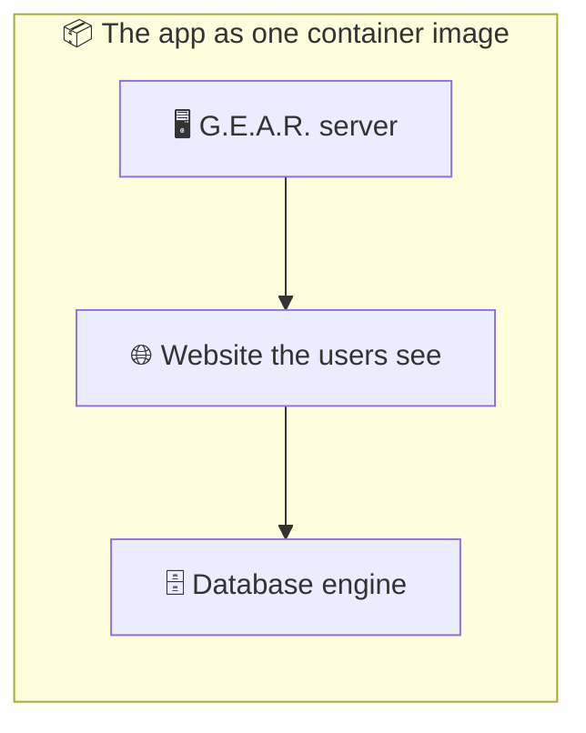
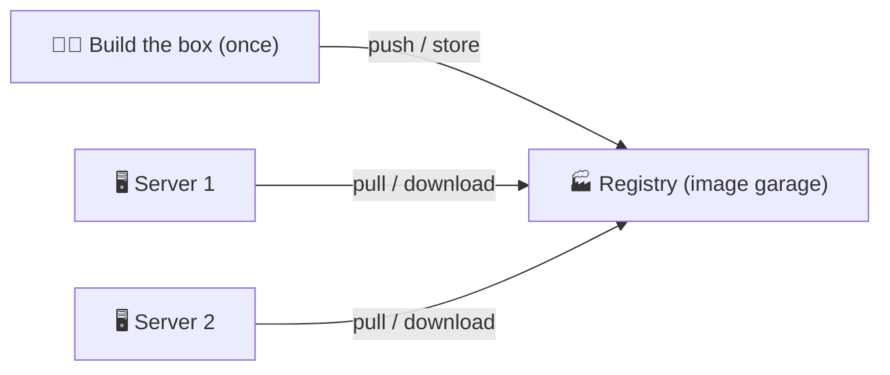
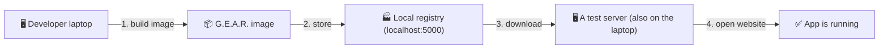
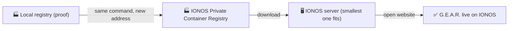
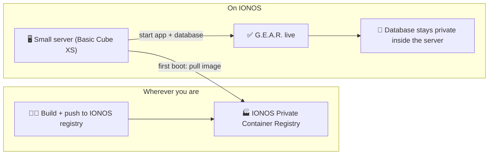
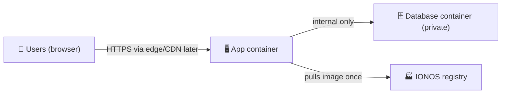
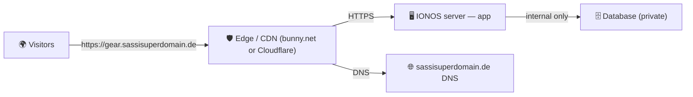

# Deploying the App — from a Local Registry to IONOS

**In short: G.E.A.R. is built once into a single, self-contained "container image", stored in a registry (a place that holds images), and the server simply downloads and starts that image. It's the same process on your laptop, on Google Cloud, and on IONOS — which is exactly why it fits IONOS so well.**

This page is written for decision-makers and people who are not deeply technical. It explains:

1. what a container image is and why it makes deployment simple,
2. how we build and store the image in a **local registry** (so we can prove everything works before touching any cloud),
3. how the same image is later pushed to IONOS, and
4. why IONOS is the right home for it.

If you want the exact commands, they are at the bottom.

---

## 1. What is a "container image" anyway?

Think of a container image as a **sealed moving box** that contains the whole app:

- the G.E.A.R. program (the "server"),
- the website that users see (the "frontend"),
- the database engine,
- and every configuration it needs to run.

Because everything is in one box, it behaves **identically everywhere**: on a developer's laptop, on a rented server, or in a cloud. No "it works on my machine" surprises. This is the industry-standard way apps are shipped today.



**Why it matters for the Ortsverband:** once the box is built, we never rebuild it per location. We build it once, store it, and every server just unpacks and runs the same box.

---

## 2. The registry: a garage for container images

A **registry** is simply the place where container images are stored, like a garage or a warehouse for the sealed boxes. You can push an image into it and pull it back out later.

There are public registries and **private** ones. We use a private one — our images are only visible to us, protected by login.



**The important insight:** Google Cloud's registry, IONOS's registry, and a registry running on your own laptop all speak the **same language** (the "Docker Registry v2" standard). That means a box pushed into our local registry can be pushed to IONOS later with the *same command, just a different address*.

---

## 3. Proving it works locally first (zero cloud cost)

Before we spend a single euro on a cloud provider, we prove the whole process on a normal laptop — for free. We run a small **local registry** (a little box that holds images), build the G.E.A.R. image, and store it there.



This proves, end-to-end, that:

- the image builds cleanly,
- it can be stored and retrieved from a registry,
- a server can download and run it, and
- the app (including the login screen and the dashboard) works from the downloaded image.

**If it works here, it will work on IONOS** — because the process is identical.

---

## 4. The same image on IONOS

When we are ready to go live, we do exactly the same thing on IONOS:



### Why IONOS fits well

- **IONOS has its own private container registry.** It is fully managed (IONOS runs it for us), supports the same standard we already use, and costs only about **$0.05 per GB per month** — for our small app that is roughly **one or two cents a month**.
- **The smallest IONOS server is enough.** Our deployment only *downloads* and runs the image (it never builds it), which is light on memory. The smallest option — **Basic Cube XS: 1 processor, 2 GB RAM, 60 GB disk, about $5.76 per month** — fits a single Ortsverband's workload comfortably. There is a larger option (4 GB RAM) if we ever want more headroom.
- **No lock-in.** Because the app is a standard container image, it is not tied to IONOS. If security or cost ever pointed elsewhere (Google, another provider, or a self-hosted server), the same image runs there with minimal work. This is a deliberate design choice: the app itself knows nothing about the cloud it runs on.
- **Security by default:** the database never exposes itself to the internet, and passwords are stored only on the server itself (not in the cloud or in the code). The same rules apply on any provider.

> **Bottom line for decision-makers:** we prove it locally, then run the identical, already-tested process on IONOS — on the cheapest server, with a registry that costs almost nothing, and no vendor lock-in.

---

## 5. Step by step on a small IONOS server (with the IONOS registry)

Here is exactly how the pieces fit together once we move to IONOS. The story has two halves: **getting the image into the IONOS registry** (done once, from any machine) and **setting up the small server** (done once, on IONOS).



### Step 1 — Create the IONOS registry and a login token

In the IONOS cloud console you create a **Private Container Registry** (a few clicks; it costs about **$0.05 per GB per month**). IONOS gives it an address (a domain name). You then create a **token** (a special password) that lets us log in and push images to it. IONOS can also create a **robot account / one-time token** for automated use — the same mechanism CI/CD pipelines use.

### Step 2 — Push the image to the IONOS registry (once)

On any machine with the image (e.g. the laptop where we proved it), we log in and push the *same* image we already tested locally. Only the address changes — the image and the command are identical to the local proof:

```bash
# 1. Log in to the IONOS registry with the token
podman login <ionos-registry-address>

# 2. Give the image the IONOS registry's address
podman tag gear-app <ionos-registry-address>/gear:latest

# 3. Push (store) it there
podman push <ionos-registry-address>/gear:latest
```

> Note: IONOS's registry is **HTTPS-secured**, so no `--tls-verify=false` here (that flag is only for the local proof registry on your laptop).

### Step 3 — Create the small server

In the IONOS cloud console (or via their API / Data Center Designer) we create a **Basic Cube XS** server: **1 processor, 2 GB RAM, 60 GB disk, about $5.76 per month**. We give it a secure SSH key so only we can log in. The server runs a normal Linux operating system — there is nothing IONOS-specific about what runs inside it.

### Step 4 — First boot: download the app and start it

We copy the small deployment folder (`compose.prod.yaml` + `startup.sh`) onto the server, log the server into the IONOS registry so it may *pull* the image, and run the first-boot script. The script:

1. generates a **secret password** for the database (stored only on the server, permissions set so nobody else can read it),
2. **downloads the app image** from the IONOS registry,
3. starts the app and its private database,
4. waits until the app answers "I am healthy".

```bash
# On the IONOS server (once)
cd /opt/gear
GEAR_IMAGE_REPO=<ionos-registry-address>/gear:latest \
GEAR_APP_ORIGIN=https://gear.example.org \
bash deploy/startup.sh
```

### Step 5 — Everyone opens the website

After the script finishes, the app is reachable at its public address. The database is **not** exposed to the internet — only the app talks to it, and only the app is reachable from outside.



**What the server does NOT do:** it never builds the app, never compiles code, and needs no development tools — it only downloads and runs a ready-made image. That is why the smallest server is enough.

### Updating the app later

When we release a new version, we simply:

1. build the new image and push it to the IONOS registry (Step 2),
2. on the server: `docker compose -f deploy/compose.prod.yaml pull && docker compose -f deploy/compose.prod.yaml up -d`.

The database stays untouched; only the app is replaced.

---

## 6. Putting it on the internet: bunny.net or Cloudflare (with sassisuperdomain.de)

The small IONOS server gives us the running app, but for a professional, trustworthy website we put a **"front door"** in front of it. A service such as **bunny.net** or **Cloudflare** sits between the visitors and our server and provides three things the app alone does not:

- **TLS / HTTPS** — the padlock in the browser. All traffic between the visitor and the app is encrypted (NFR-S1: TLS 1.2 or higher).
- **Caching** — static parts of the site (the G.E.A.R. website files) are stored "close" to the visitor, so pages load faster and the small server does less work.
- **Protection** — basic DDoS and abuse filtering, so a malicious flood of requests does not knock the app over.

We already own the domain **`sassisuperdomain.de`** — this section explains exactly what is needed to point it at the app through such a service.



### What we need regardless of provider

1. **A subdomain** — e.g. `gear.sassisuperdomain.de` — so the app lives at a clean address and the edge/CDN can be pointed at it.
2. **Access to the domain's DNS** — the registrar (or a DNS provider) must allow us to add the records the edge service gives us. Because we own `sassisuperdomain.de`, this is under our control.
3. **The app's public address** — the IONOS server's IP (and port 8080 by default). The edge service forwards traffic to this address.
4. **The app must know its own public address** — so password-reset links point to the real site. We set `GEAR_APP_ORIGIN=https://gear.sassisuperdomain.de` on the server (`deploy/startup.sh` reads it). This is already built into the deployment.

### With bunny.net

bunny.net is a simple, affordable CDN with a built-in "Pull Zone". The steps:

1. **Create an account and a Pull Zone** — in the bunny.net console, create a **Pull Zone** for `gear.sassisuperdomain.de` with the **Origin URL** set to the IONOS server (`http://<ionos-ip>:8080`). This tells bunny.net where to fetch the app.
2. **Get a TLS certificate** — bunny.net issues a free Let's Encrypt certificate automatically for the zone.
3. **Add a CNAME record in DNS** — in `sassisuperdomain.de`'s DNS, add a CNAME from `gear` to the Pull Zone address bunny.net shows (e.g. `gear.b-cdn.net`). bunny.net's console gives you the exact record to create.
4. **Done** — within minutes `https://gear.sassisuperdomain.de` shows the app, encrypted and cached.

### With Cloudflare

Cloudflare is a very widely used, free-forever edge. The steps:

1. **Add the domain to a Cloudflare account** — enter `sassisuperdomain.de`; Cloudflare scans and imports the existing DNS records.
2. **Switch the domain's name servers** — the registrar for `sassisuperdomain.de` must point the domain's name servers to the two Cloudflare name servers Cloudflare shows (this is the one step that touches the registrar). After that, Cloudflare manages DNS.
3. **Add a DNS record** — an `A` record for `gear` pointing to the IONOS server's IP (proxied = the orange cloud icon on, so traffic goes through Cloudflare).
4. **Enable HTTPS** — Cloudflare's "Flexible/Full" SSL setting issues a free certificate; with **Full** it also encrypts the hop between Cloudflare and the IONOS server.
5. **Done** — `https://gear.sassisuperdomain.de` is served through Cloudflare with TLS, caching, and protection.

### What changes on our side

- The IONOS server keeps listening on its port; the edge service fronts it.
- `GEAR_APP_ORIGIN` on the server is set to `https://gear.sassisuperdomain.de` (already supported by `deploy/startup.sh`).
- The firewall on the IONOS server can be tightened later to only accept traffic from the edge provider's IP ranges — a hardening step we can do after the edge is live.

### Which to choose

| | bunny.net | Cloudflare |
|---|---|---|
| **Cost** | Cheap, pay-as-you-go CDN | Generous free tier |
| **Setup** | Pull Zone + one DNS CNAME | Add domain + change name servers (touches the registrar once) |
| **Caching / CDN** | Excellent, purpose-built | Excellent, plus WAF / bot protection |
| **Best for** | Simple, low-cost CDN in front of our server | Maximum protection + a "set and forget" free edge |

Both work with the same deployment — this decision does not affect the app, the registry, or the server; it is purely the "front door" configuration.

---

## 7. The exact commands (for the technically minded)

All of this runs with **Podman** (a free, open-source container tool already installed on the dev machines — no Docker license needed).

### Build the image

```bash
just container-build
```

This builds the whole app — frontend + server — into one image named `gear-app`.

### Start a local registry

```bash
podman run -d --name gear-registry -p 5000:5000 \
  -v gear_registry_data:/var/lib/registry docker.io/library/registry:2 \
  || podman start gear-registry
```

This starts a tiny registry on the laptop at `localhost:5000`.

### Tag and store the image in the registry

```bash
podman tag gear-app localhost:5000/gear:local
podman push --tls-verify=false localhost:5000/gear:local
```

The second line "pushes" (stores) the image into the registry.

### Verify it is stored

```bash
curl -s http://localhost:5000/v2/_catalog
# -> {"repositories":["gear"]}
```

### The one-shot convenience recipe

The whole build + store + run flow is bundled into a single command:

```bash
just deploy-local-proof      # build → push to local registry → run the app from it → check it is healthy
just deploy-local-proof-down # stop everything and clean up
```

> The `--tls-verify=false` flag is only needed because the **local** registry speaks plain HTTP. IONOS's registry (and Google's) use secure HTTPS, so the flag is dropped there.

---

## Where this lives in the project

- `Dockerfile` — the recipe that builds the image.
- `deploy/compose.prod.yaml` — the file that says how the downloaded image runs (app + database, database kept private).
- `deploy/startup.sh` — the "first boot" script a server runs: download the image, start it, wait until it is healthy.
- `infra/` — the scripts that create the server on Google Cloud (a separate, optional path).
- `deploy/README.md` and `infra/README.md` — the detailed operator runbooks (in English, for whoever runs the servers).

---

## More reading

- [Management Overview](/docs/management-overview) — what the app does, in plain language.
- [Module Roadmap](/docs/planning/module-roadmap) — the wider product plans.
- [Architecture Spine](/docs/planning/architecture-spine) — the deep technical background.